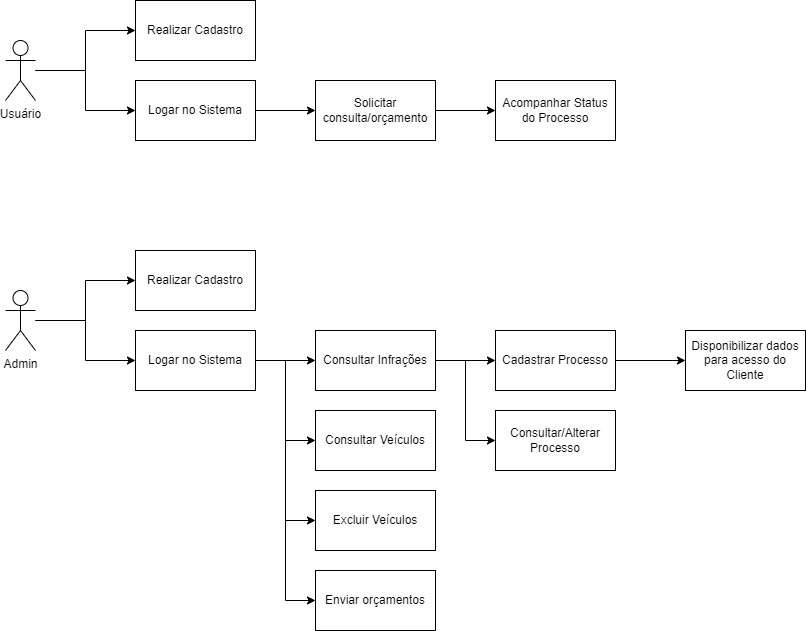
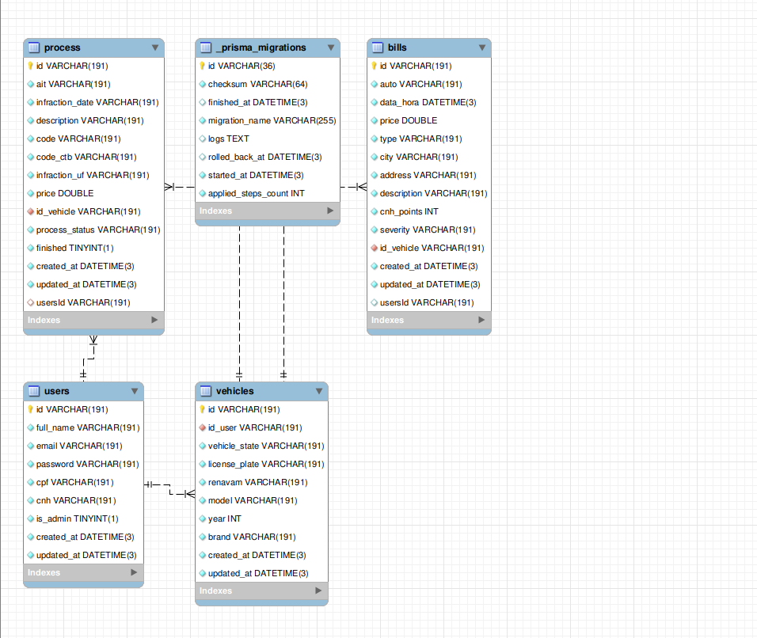

# Projeto Integrador - Gama Academy 

## Projeto desenvolvido durante o bootcamp Dev For Tech da GamaAcademy em parceria com a ACATE.  

**Nome do time:** *Time 04*

**Integrantes do time:**

[Carlos Edwardo](https://github.com/carlosexsantos)

[Gabriel Corrêa](https://github.com/gscorrea10)

[Igor Cenzi](https://github.com/igorcenzi)

[Levi Lima](https://github.com/levilimas)

**Objetivo do projeto:**

Uma API para empresa que oferece serviços de recursos de multas, onde ela irá poder consultar as infrações do veículo pela placa/Renavam, cadastrar e gerir os processos solicitados pelos clientes e disponibilizar o status do andamento do recurso para que o cliente possa acompanhar de forma dinâmica.

**Especificações Técnicas:**

API RESTFULL construída seguindo os padrões MVC (model-view-controller), utilizando a linguagem JavaScript para back-end (NodeJs).

Conexão com um banco de dados Mysql sendo feita através da ORM (Object-Relational Mapping) Prisma.

Utiliza uma [API externa](https://infosimples.com/) para fazer consultas sobre dados de veículos, quando a consulta é feita, os dados do resultado referente às multas deste veículo são armazenadas em banco de dados para futuras consultas.

## Links importantes:

**Repositório:  [Github](https://github.com/gscorrea10/projeto-integrador-devfortech)**

**Kanban: [Trello](https://trello.com/b/cz7YYzPG/squad-4)**

## Horários de reuniões:

**Encontros:** *Sábados 09:00h - 12:00h*

## Sprints

|  | Data de Início | Data de Finalização |
| --- | --- | --- |
| Sprint 1 | 29/08/2022 | 03/09/2022 |
| Sprint 2 | 05/09/2022 | 14/09/2022 |
| Sprint 3 | 15/09/2022 | 22/09/2022 |

## Quadro Kanban

### Colunas

- [x]  Backlog
- [ ]  Funcionalidades
- [x]  A fazer
- [x]  Em andamento
- [x]  Revisão
- [x]  Testes
- [ ]  Homologado
- [x]  Concluído

## Padrões Git

**Branch de features:**  feature/nome-da-funcionalidade

**Commits:**

- [x]  feat
- [x]  fix
- [ ]  style
- [x]  refactor
- [x]  test
- [x]  docs
- [ ]  chore

## Bibliotecas Utilizadas no Back-End


1. [express](https://expressjs.com/pt-br/)
2. [jsonwebtoken](https://jwt.io/)
3. [bcryptjs](https://www.npmjs.com/package/bcryptjs)
4. [axios](https://axios-http.com/ptbr/docs/intro)
5. [cors](https://www.npmjs.com/package/cors)
6. [dotenv](https://www.npmjs.com/package/dotenv)
7. [prisma](https://www.prisma.io/docs/)
8. [nodemon](https://nodemon.io/)
9. [sucrase](https://www.npmjs.com/package/sucrase)
10. [express-validator](https://express-validator.github.io/docs/)


### Diagrama de Casos de Uso

</img>

### DER

 </img>

# Como executar

* Clone o repositório
```
xxxxx
```
* Instalar as dependências do projeto
```
npm install
```
* Rodar as migrations do prisma no banco de dados
```
npx prisma migrate dev
```
* Inicie o servidor
```
npm run dev
```
* Para abrir o Prisma Studio (db visual editor)
```
npx prisma studio
```
